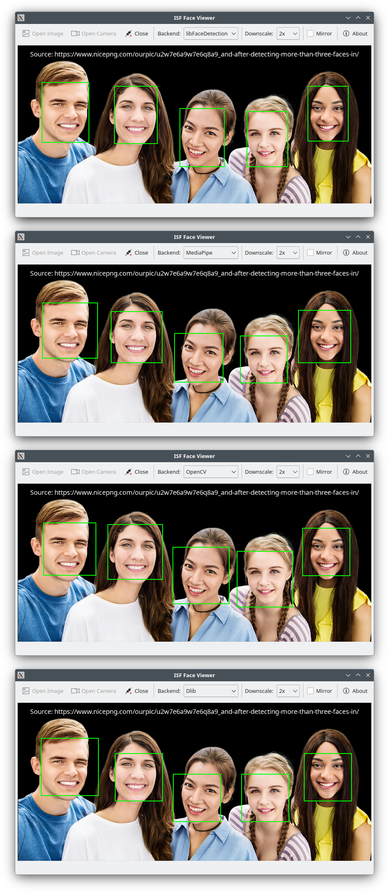

# IFD: ISF Face Detector

## Introduction

IFD is a C++ library providing access to various popular face-detection implementations through a single uniform API. It was developed with two goals:

1. Provide a facility to easily compare and evaluate different implementations
2. Add an abstration layer to encapsulate the details of these implementations

Applications using IFD need to include only a single header file and link against a single library. Backends can thus be added or replaced at any time without breaking binary compatibility.

Available backends can be queried at runtime. A detector can then be instantiated using either a specific backend or the preferred default.

The library supports RGB, RGBA, BGR, BGRA and grayscale images and automatically performs any conversions required. The preferred format for the selected backend can also be queried at runtime.

The following backends are currently available (in the order of preference):
- libfacedetection
- MediaPipe
- OpenCV
- Dlib

An accompanying example program is also provided that reads images from a camera and allows switching between backends on the fly. The images can optionally be downscaled before processing to improve performance.

## License

The library is released under the GNU Lesser General Public License (LGPL) and the example program under the GNU General Public License (GPL). See [COPYING](COPYING) along with [COPYING.LESSER](COPYING.LESSER) for details.

## Supported Platforms

IFD requires a working C++20 compiler. It was developed under Linux but is designed to also be compilable under Windows using MSYS2. Other compilers and operating systems are likely to work as well but may require adjustments to the build system and haven't been tested.

## Building

IFD uses [CMake](https://cmake.org/) to build. Since the process is quite involved, a set of scripts is provided to facilitate the build.

Copy or symlink the scripts to the build directory and run 'build-all.sh' to build the library along with the example program. The resulting output directory will contain everything needed to build and run your own applications.

You can also edit the variable 'BACKEND_ARGS' in 'build-libIFD.sh' to select the backends to be built and then adjust 'build-all.sh' to avoid building unused components.

Snapshots of libfacedetection and openpnp-capture (used by the example program to access the camera) are included under 3rdparty. Other dependencies like OpenCV, Dlib or Qt need to be installed on your system. MediaPipe will automatically be downloaded by the build script. You will need Git and Bazelisk to be installed on your system.

## Using the Library
The following pseudo-code shows a basic example:

```cpp
std::vector<std::string> backends =
        ifd::FaceDetector::getAvailableBackends();

std::string backend = selectBackend(backends);

ifd::FaceDetector detector(ImageWidth, ImageHeight, backend);

std::vector<ifd::RgbPixel> image = readImage();
std::vector<ifd::Rect> results;

detector.process(image, &results);
```

Note that the image data must be continuous and not contain any extra padding as is often used to align scanlines to four-byte boundaries.

## Known Bugs

In some cases switching from the MediaPipe backend to the OpenCV backend causes the application to crash. This may be related to the use of GPU acceleration in both backend libraries.

## Results


